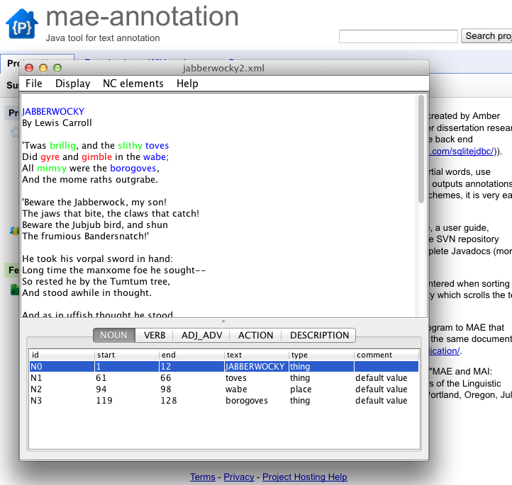
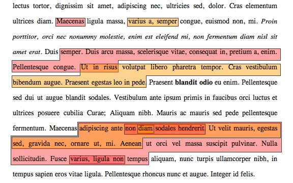
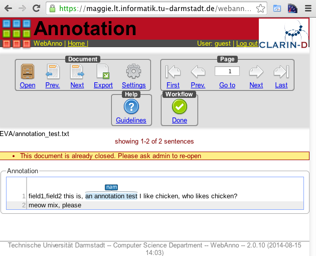
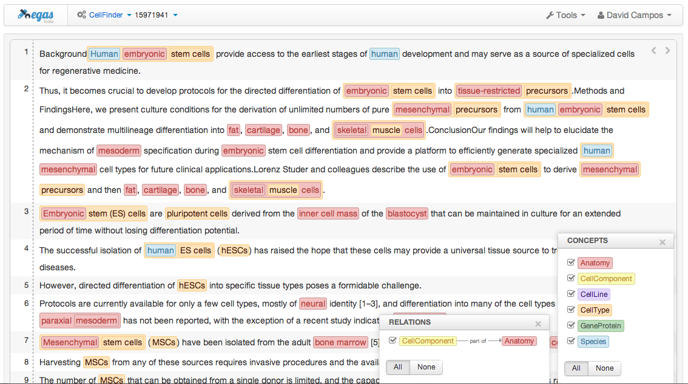
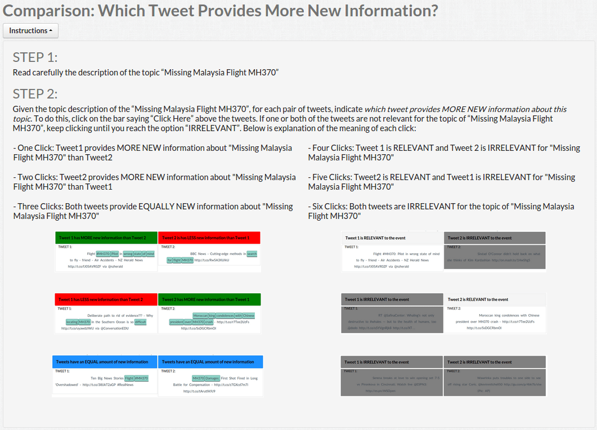
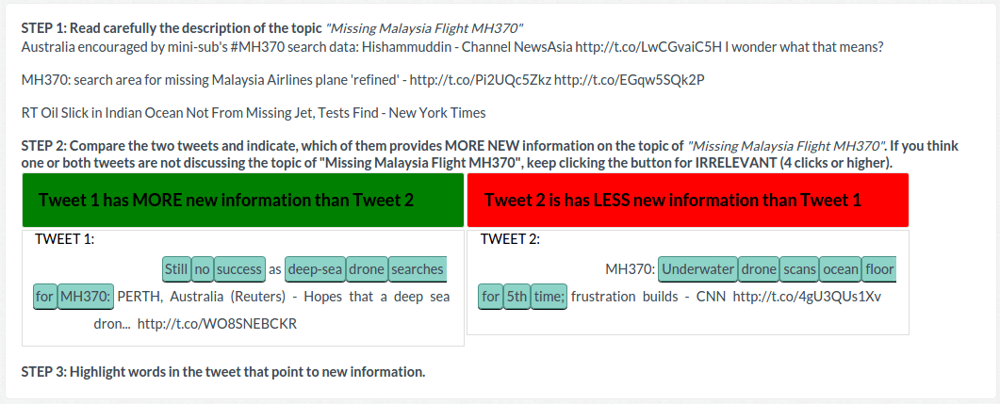
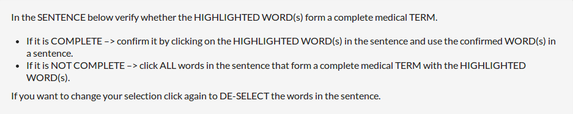

## Tools (online or PC-based)

Thanks to [Hristo Tanev](mailto:htanev@yahoo.co.uk) for compiling a preliminary list and emailing the [Corpora List](mailto:corpora@hd.uib.no).

* [MAE](https://code.google.com/p/mae-annotation/) (Multi-purpose Annotation Environment) is an annotation tool created by Amber Stubbs (http://amberstubbs.net) for Brandeis University for use in her dissertation research. It is a lightweight program written in Java, with a MySQLite database back end (SQLiteJDBC driver created by David Crawshaw (http://www.zentus.com/sqlitejdbc/)).
  - Recommended by: Michele Flannino
  - Author: Amber Stubbs
  - Last updated: 2012-05-11
  - 

* [Glozz](http://www.glozz.org/)
  - Recommended by: Sophie Rosset
  - Author: Unclear, someone French
  - Last updated: 2014-07-04
  - **Not open source / behind email paywall**
  - 

* [Sanchay](http://sanchay.co.in)
  - Recommended by: Anil Singh
  - Last updated: 2012-09-01

* [WebAnno](https://webanno.github.io/webanno/)
  - Author: Unclear, someone at University of Darmstadt
  - Recommended by: Wladimir Sidorenko and Bollette Pedersen
  - Last updated: 2014-01
  - 

* [BRAT: brat rapid annotation tool](http://brat.nlplab.org/)
  - Recommended by: Omnia Zayed
  - Users SVG visualization, which doesn't support RTL scripts (like Arabic)
  - 

* [CAT: Content Annotation Tool](https://dh.fbk.eu/resources/cat-content-annotation-tool)
  - Recommended by: Sara Tonelli
  - Unclear what it looks like, whether it's web-based, Java, or what
  - **Not open source / behind extensive login form**

* [MAT: MITRE Annotation Toolkit](http://mat-annotation.sourceforge.net/)
  - Unclear how this works; appears to be some mixture of Python, Java, and online
  - No demo / screenshots
  - Recommended by: Craig Pfeifer

* [FLAT: FoLiA Linguistic Annotation Tool](https://github.com/proycon/flat)
  - Recommended by: Ali Hurriyetoglu
  - Uses Python with Django / CherryPy
  - Looks like it's a jQuery-UI heavy interface (moar rounded corners!)
  - Uses the XML-based [FoLiA](http://proycon.github.io/folia/) format
  - 

* [Egas](http://bioinformatics.ua.pt/egas/)
  > As one of the authors of the tool, I would like to suggest you Egas, a web-based platform for biomedical text mining and collaborative curation, supporting manual and automatic annotation of concepts and relations.
  - Author: [David Campos](mailto:david.campos@ua.pt)
  - Recommended by: [David Campos](mailto:david.campos@ua.pt)
  - 

* [CrowdTruth](https://github.com/CrowdTruth/CrowdTruth)
  > The CrowdTruth Framework implements an approach to machine-human computing for collecting annotation data on text, images, sounds and videos.
  - jQuery, Bootstrap, require.js, Python, Jinja, with some CrowdFlower (?!) markup mixed in
  - 
  - 

* [PyBossa](http://pybossa.com/)
  > PYBOSSA is the ultimate crowdsourcing framework to analyze or enrich data that can't be processed by machines alone.
  - Inspired by [Bossa](https://boinc.berkeley.edu/trac/wiki/BossaIntro), which is "an open-source software framework for distributed thinking" built with PHP.

## License

To the extent possible under law, [Christopher Brown](https://github.com/chbrown) has waived all copyright and related or neighboring rights to this work.
